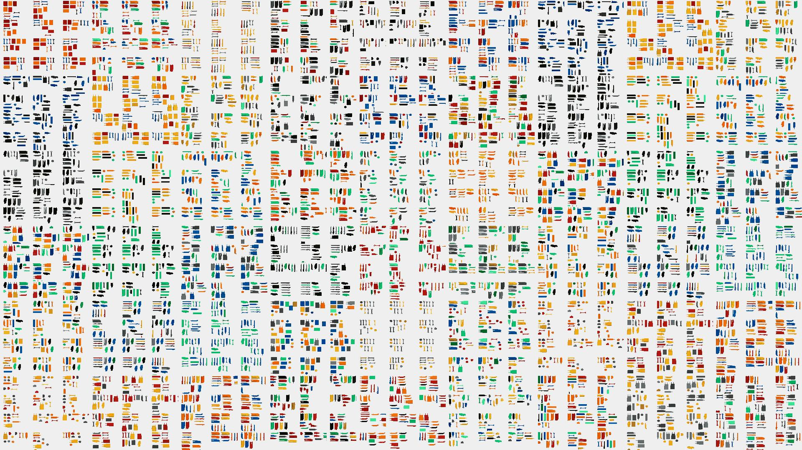

# Knolling Bot: Learning Robotic Object Arrangement from Tidy Demonstrations

This repository contains the supplementary materials for our paper titled "Knolling Bot: Learning Robotic Object Arrangement from Tidy Demonstrations," submitted for review. In this work, we address the complex challenge of organizing scattered items in domestic spaces by introducing a self-supervised learning framework. Inspired by advancements in natural language processing (NLP), our approach allows robots to understand and replicate the concept of tidiness from demonstrations of well-organized layouts.

*Teaser: A collage of 54 test results showcasing 12 different tidy table layouts generated by our model for each test data, illustrating the model's ability to create diverse tidy arrangements.*

## Repository Structure

- `supplemental_materials.pdf`: Contains additional details and results supplementing our submitted paper.
- `knolling_bot/`: Directory housing the code for training and testing the knolling model.
  - `Arrange_knolling_model/`: Contains the implementation of our knolling model.
    - `train_and_test/`: Scripts and data for training and evaluating the model.
      - `data/flowing-moon-116/`: Directory where the trained model is stored.

## Usage

To use the code provided in this repository, follow the instructions in the respective directories. Ensure you have the necessary dependencies installed as specified in the `requirements.txt` file located in the root of the `knolling_bot` directory.

## Citation

If you find our work useful, please consider citing it as follows:

@article{hu2023knolling,
  title={Knolling bot: A Transformer-based Approach to Organizing a Messy Table},
  author={Hu, Yuhang and Zhang, Zhizhuo and Liu, Ruibo and Wyder, Philippe and Lipson, Hod},
  journal={arXiv preprint arXiv:2310.04566},
  year={2023}
}

## Acknowledgments

This work was supported in part by the US National Science Foundation (NSF) AI Institute for Dynamical Systems (DynamicsAI.org), grant 2112085. Special thanks to all contributors and collaborators involved in this project.
